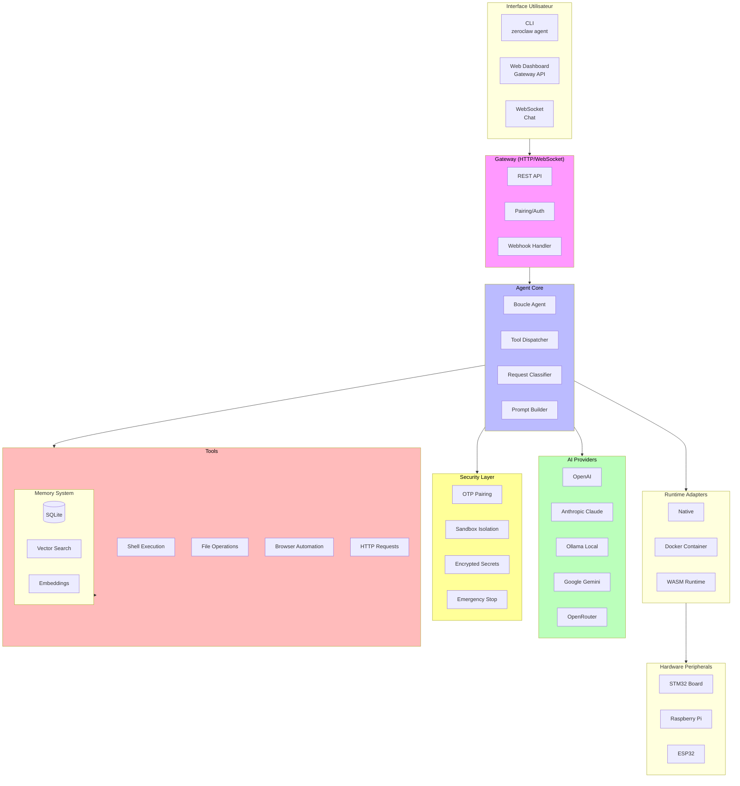
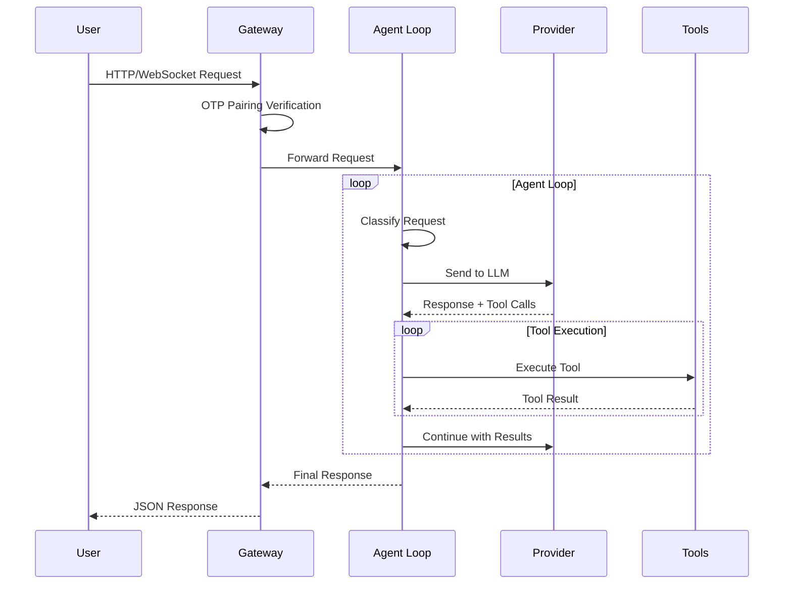
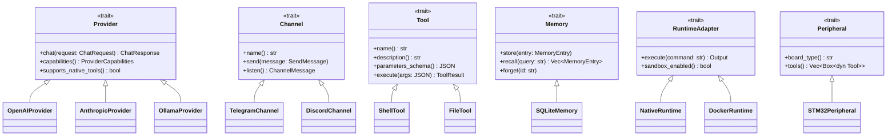

# Compte Rendu d'Analyse Architecturale - ZeroClaw 🦀

## 1. Vue d'Ensemble du Projet

ZeroClaw est un **runtime d'agent IA autonome** écrit à 100% en Rust, conçu pour être léger, sécurisé et portable. Le projet privilégie les performances (binaire ~8.8MB, démarrage <10ms) et fonctionne sur du matériel à faible coût (10$).

### 1.1 Diagramme d'Architecture



### 1.2 Flux de Données Principal



### 1.3 Points d'Extension (Traits)



---


## 2. Les Traits Rust : Le Cœur de l'Architecture

### 2.1 Qu'est-ce qu'un Trait ?

Un **trait** en Rust est un concept qui n'existe pas tel quel dans la plupart des langages mainstream. Il combine plusieurs idées :

| Concept dans d'autres langages | Équivalent Rust |
|--------------------------------|----------------|
| Interface (Java, Go) | Trait |
| Protocol (Elixir, Swift) | Trait |
| ABC (Python) | Trait + `#[derive]` |
| Concept (C++20) | Trait |

**Définition simple** : Un trait définit un *contrat* — un ensemble de méthodes qu'un type doit implémenter.

### 2.2 Syntaxe de Base

```rust
// Définir un trait
trait Drawable {
    // Signature de méthode (sans implémentation)
    fn draw(&self);
    
    // Les traits peuvent avoir des méthodes par défaut
    fn area(&self) -> f64 {
        0.0  // Implémentation par défaut
    }
}

// Implémenter un trait pour un type
struct Circle {
    radius: f64,
}

impl Drawable for Circle {
    fn draw(&self) {
        println!("Drawing circle with radius {}", self.radius);
    }
    
    fn area(&self) -> f64 {
        std::f64::consts::PI * self.radius * self.radius
    }
}

// Utilisation polymorphique via "trait objects"
fn render(item: &dyn Drawable) {
    item.draw();
}
```

### 2.3 Pourquoi les Traits dans ZeroClaw ?

Dans ce projet, **chaque subsystem est un trait** :

```rust
// src/providers/traits.rs
#[async_trait]
pub trait Provider: Send + Sync {
    async fn chat(&self, request: ChatRequest) -> anyhow::Result<ChatResponse>;
    fn capabilities(&self) -> ProviderCapabilities { ... }
    fn supports_native_tools(&self) -> bool { ... }
}

// src/channels/traits.rs
#[async_trait]
pub trait Channel: Send + Sync {
    fn name(&self) -> &str;
    async fn send(&self, message: &SendMessage) -> anyhow::Result<()>;
    async fn listen(&self, tx: tokio::sync::mpsc::Sender<ChannelMessage>) -> anyhow::Result<()>;
}

// src/tools/traits.rs
#[async_trait]
pub trait Tool: Send + Sync {
    fn name(&self) -> &str;
    fn description(&self) -> &str;
    fn parameters_schema(&self) -> serde_json::Value;
    async fn execute(&self, args: serde_json::Value) -> anyhow::Result<ToolResult>;
}
```

### 2.4 L'Avantage Clé : Polymorphisme Statique et Dynamique

**Option A : Polymorphisme statique (generics)**
```rust
fn process<T: Provider>(provider: &T) {
    // Le compilateur génère du code spécialisé pour chaque type
}
```
→ Plus rapide (pas de dispatch dynamique), mais génère plus de code.

**Option B : Polymorphisme dynamique (trait objects)**
```rust
fn process(provider: &dyn Provider) {
    // Un seul code, dispatch à runtime via vtable
}
```
→ Plus flexible, moins de code compilé.

**Dans ZeroClaw**, on utilise les deux :
- Generics pour la performance (`AgentBuilder::new()`)
- Trait objects pour la flexibilité (`Box<dyn Tool>`)

### 2.5 Pattern Factory avec Traits

```rust
// src/providers/mod.rs - Enregistrement des providers
pub fn create_provider(name: &str, config: &ProviderConfig) -> anyhow::Result<Box<dyn Provider>> {
    match name {
        "openai" => Ok(Box::new(OpenAIProvider::new(config)?)),
        "anthropic" => Ok(Box::new(AnthropicProvider::new(config)?)),
        "ollama" => Ok(Box::new(OllamaProvider::new(config)?)),
        // Ajouter un nouveau provider = 1 case dans le match
        _ => anyhow::bail!("Unknown provider: {name}"),
    }
}
```

### 2.6 Bounds et Héritage de Traits

```rust
// "Send + Sync" = le type peut être partagé entre threads
pub trait Provider: Send + Sync { ... }

// Héritage de traits
trait AdvancedProvider: Provider {
    fn streaming(&self) -> bool;
}
```

---

## 3. Architecture Fondamentale : Trait-Driven

L'architecture repose sur un système de **traits** qui définissent des points d'extension pluggables :

### 3.1 Points d'Extension Principaux

| Extension | Fichier Trait | Description |
|-----------|---------------|-------------|
| **Provider** | `src/providers/traits.rs` | Modèles LLM (OpenAI, Anthropic, Ollama, etc.) |
| **Channel** | `src/channels/traits.rs` | Plateformes de messagerie (Telegram, Discord, Slack, etc.) |
| **Tool** | `src/tools/traits.rs` | Capacités exécutables (shell, file, memory, etc.) |
| **Memory** | `src/memory/traits.rs` | Backend de persistance (SQLite, PostgreSQL, Lucid) |
| **RuntimeAdapter** | `src/runtime/traits.rs` | Environnements d'exécution (native, Docker, WASM) |
| **Sandbox** | `src/security/traits.rs` | Isolation au niveau OS (firejail, bubblewrap, landlock) |
| **Peripheral** | `src/peripherals/` | Matériel (STM32, Raspberry Pi, ESP32) |
| **Observer** | `src/observability/` | Métriques et traçage (Prometheus, OTEL) |

### 3.2 Pattern Builder avec Traits
```rust
// src/agent/agent.rs
AgentBuilder::new()
    .provider(Box::new(openai_provider))  // &dyn Provider → Box<dyn Provider>
    .tools(vec![...])                     // Vec<Box<dyn Tool>>
    .memory(arc_sqlite)                   // Arc<dyn Memory>
    .build()?
```

---

## 4. Structure des Modules Principaux

```
src/
├── agent/           # Orchestration de la boucle agent
│   ├── agent.rs     # Agent principal avec AgentBuilder
│   ├── loop_.rs     # Boucle d'exécution des tools
│   ├── dispatcher.rs # Parsing des tool calls (XML, native)
│   ├── prompt.rs    # Construction du prompt système
│   └── classifier.rs # Classification des requêtes
│
├── providers/       # Connecteurs LLM
│   ├── traits.rs    # Trait Provider + ChatMessage, ToolCall
│   ├── openai.rs    # OpenAI / OpenAI Codex
│   ├── anthropic.rs # Anthropic Claude
│   ├── ollama.rs    # Ollama local
│   ├── openrouter.rs# OpenRouter agrégateur
│   ├── reliable.rs  # Wrapper de résilience
│   └── router.rs    # Routage intelligent
│
├── channels/        # Connecteurs messaging
│   ├── traits.rs   # Trait Channel + ChannelMessage
│   ├── telegram.rs  # Telegram
│   ├── discord.rs  # Discord
│   ├── slack.rs    # Slack
│   └── whatsapp.rs # WhatsApp
│
├── tools/          # Capacités exécutables
│   ├── traits.rs   # Trait Tool + ToolResult
│   ├── shell.rs    # Exécution commande shell
│   ├── file_*.rs   # Lecture/écriture fichiers
│   ├── memory_*.rs # Outils mémoire
│   └── browser.rs  # Automatisation navigateur
│
├── memory/         # Système de persistance
│   ├── traits.rs   # Trait Memory + MemoryEntry
│   ├── sqlite.rs   # Backend SQLite avec vecteur embeddings
│   ├── postgres.rs # Backend PostgreSQL
│   ├── vector.rs   # Recherche hybride (vector + keyword)
│   └── embeddings.rs# Génération d'embeddings
│
├── security/       # Couche sécurité
│   ├── traits.rs   # Trait Sandbox
│   ├── pairing.rs  # Authentification par code OTP
│   ├── policy.rs   # Politiques de sécurité
│   ├── secrets.rs  # Chiffrement des secrets (ChaCha20-Poly1305)
│   └── estop.rs    # Emergency stop
│
├── runtime/        # Adaptateurs d'exécution
│   ├── traits.rs   # Trait RuntimeAdapter
│   ├── native.rs   # Exécution native
│   ├── docker.rs   # Conteneur Docker
│   └── wasm.rs     # Runtime WASM (wasmi)
│
└── gateway/        # Serveur HTTP/WebSocket
    ├── api.rs      # Endpoints webhook
    ├── ws.rs       # WebSocket
    └── sse.rs      # Server-Sent Events
```

---

## 5. Sécurité (Secure by Default)

### 5.1 Mesures Implémentées
- **Pairing** : Code OTP à 6 chiffres au démarrage
- **Allowlist** : Deny-by-default pour les channels
- **Workspace scoping** : Restriction filesystem par défaut
- **Sandboxing** : firejail, bubblewrap, landlock optionnel
- **Secrets chiffrés** : AEAD ChaCha20-Poly1305
- **E-Stop** : Emergency stop multi-niveaux
- **No unsafe code** : `#![forbid(unsafe_code)]`

---

## 6. Forces du Projet

✅ **Architecture modulaire** : Tout est pluggable via traits  
✅ **Sécurité** : Pairing, sandboxing, allowlists, chiffrement  
✅ **Léger** : <5MB RAM, binaire ~9MB  
✅ **Polyvalent** : Multi-provider, multi-channel, multi-hardware  
✅ **Rust-first** : Pas de unsafe code, performances optimisées  
✅ **Documenté** : Documentation complète multi-langue  

---

Ce projet incarne une philosophie **"Zero overhead. Zero compromise. 100% Rust"** avec une architecture élégante basée sur les traits Rust, permettant une extensibilité maximale tout en maintenant une empreinte mémoire et une taille de binaire minimales.